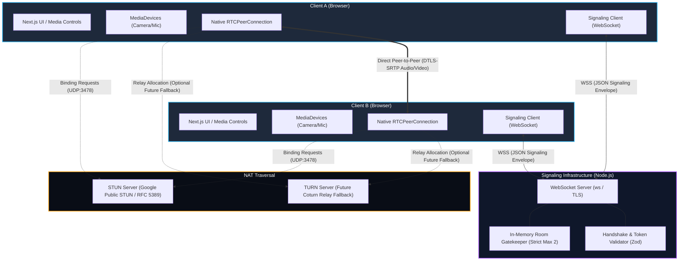
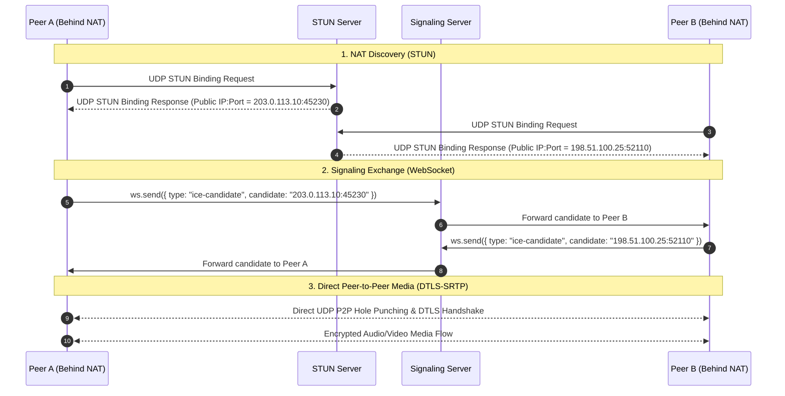

# Private 1-to-1 Video Calling Application: System Architecture

## 1. Executive Summary

This document defines the system architecture for a private, encrypted, 1-to-1 WebRTC audio/video calling application. The solution is engineered as a lean, modern TypeScript monorepo utilizing Next.js for the client application, a lightweight Node.js service for real-time WebSocket signaling, and native browser WebRTC APIs for peer-to-peer media transmission.

The architecture strictly decouples the **Signaling Plane** (room discovery, peer pairing, SDP negotiation, and ICE candidate trickle) from the **Media Plane** (direct peer-to-peer encrypted audio/video streaming via DTLS-SRTP).

---

## 2. High-Level System Architecture



---

## 3. Plane Separation: Signaling vs. Media

A fundamental principle of WebRTC architecture is the strict segregation of responsibilities between signaling and media transport:

| Dimension | Signaling Plane | Media Plane |
| :--- | :--- | :--- |
| **Protocol** | WebSocket over TLS (`wss://`) / TCP | DTLS-SRTP / UDP (fallback to TCP only on TURN) |
| **Path** | Client <--> Node.js Server <--> Peer Client | Direct Client <==> Peer Client (P2P) |
| **Bandwidth** | Very Low (JSON metadata, ~a few KB during handshakes) | High (Adaptive Bitrate 500 Kbps - 4 Mbps) |
| **Latency Requirement** | Low (< 200 ms for call setup) | Ultra-low real-time (< 150 ms one-way delay) |
| **Payload Content** | Room authorization, SDP Offers/Answers, ICE candidates | H.264 / VP8 / VP9 / AV1 video & Opus audio |
| **Server Involvement** | Centralized message routing, secret verification & gatekeeper | **Zero**. Server never touches or inspects media |
| **Encryption** | Standard TLS 1.3 | Native WebRTC DTLS 1.2+ & SRTP (AES-GCM-128/256) |

---

## 4. System Components

### 4.1. Web Application (`apps/web`)
- **Framework**: Next.js (App Router), React, TypeScript.
- **Core Responsibilities**:
  - Render user interface for room creation, secret key generation, and in-call media controls.
  - Acquire and manage local hardware devices via `navigator.mediaDevices.getUserMedia`.
  - Handle audio/video device enumeration, track muting, track replacement (e.g. camera switching, screen sharing).
  - Manage native `RTCPeerConnection` instance and track connection/ICE states.
  - Render local and remote `<video>` and `<audio>` HTML elements with appropriate mirroring, aspect ratios, and volume controls.
  - Implement the **Perfect Negotiation** state machine for glitch-free bidirectional SDP renegotiation.

### 4.2. Signaling Server (`apps/signaling`)
- **Runtime**: Lightweight Node.js with TypeScript (`tsup` / `tsx`).
- **Zero Heavy Frameworks**: Built using native Node.js `http` + `ws` and Zod validation. No Express, no Fastify, no external database.
- **Core Responsibilities**:
  - Maintain a high-performance WebSocket server (`ws`).
  - Provide strict 1-to-1 room management:
    - Validate invitation secrets (`roomKey`).
    - Enforce room capacity of **strictly 2 participants** (rejecting third-party connections with `ROOM_FULL`).
    - Handle peer reconnection / session replacement on page refresh without false lockout.
  - Forward signaling payloads (SDP offer, SDP answer, ICE candidate) exclusively to the opposite peer in the room.
  - Handle graceful peer cleanup on socket drops or intentional disconnects.
  - Provide ping/pong heartbeat detection to prevent zombie connections.

### 4.3. Shared Protocol Package (`packages/protocol`)
- **Type Safety**: Monorepo shared package containing:
  - TypeScript interfaces for all signaling messages.
  - Zod runtime validation schemas for parsing and validating all incoming WebSocket frames.
  - Canonical error codes and room status enums.
  - Pluggable ICE configuration provider interface and STUN defaults.

---

## 5. NAT Traversal Architecture: STUN Now, TURN Later

WebRTC peers reside behind private NATs (Network Address Translation) and firewalls. Establishing a direct peer-to-peer transport connection requires interactive connectivity establishment (ICE):

1. **Local Host Candidates**: Discovered from local network interfaces (LAN IP).
2. **Server Reflexive Candidates (STUN - Initial Implementation)**:
   - Client sends UDP binding requests to an external STUN server (`stun:stun.l.google.com:19302`).
   - STUN server reflects back the client's public IP and mapped NAT port.
   - Initial deployment uses public STUN servers for zero-cost NAT traversal.



### 5.1. The Pluggable ICE Server Provider Pattern
To ensure the application seamlessly supports TURN in the future without refactoring WebRTC logic, the client consumes ICE configurations via a dedicated provider abstraction:

```typescript
// packages/protocol/src/ice-config.ts
export interface IceConfigProvider {
  getIceServers(): RTCIceServer[];
}

// Current STUN-only implementation:
export const defaultIceServers: RTCIceServer[] = [
  { urls: "stun:stun.l.google.com:19302" },
  { urls: "stun:stun1.l.google.com:19302" }
];

// Future TURN injection (Zero code changes to RTCPeerConnection lifecycle):
export function getRuntimeIceServers(): RTCIceServer[] {
  const turnUrl = process.env.NEXT_PUBLIC_TURN_URL;
  if (!turnUrl) {
    return defaultIceServers;
  }
  return [
    ...defaultIceServers,
    {
      urls: turnUrl,
      username: process.env.NEXT_PUBLIC_TURN_USERNAME,
      credential: process.env.NEXT_PUBLIC_TURN_CREDENTIAL
    }
  ];
}
```

---

## 6. Architectural Simplicity & Zero-Overhead Philosophy

To ensure reliability, privacy, and low maintenance:
1. **Zero Database**: No SQL or NoSQL database. Rooms are ephemeral in-memory entities that vanish when participants leave.
2. **Zero Message Broker**: No Redis, RabbitMQ, or Kafka. The signaling server is a self-contained, lightweight Node process.
3. **Zero WebRTC Wrapper Bloat**: No third-party abstractions (e.g. Simple-Peer, PeerJS). Native `RTCPeerConnection` is used directly, adhering strictly to standard W3C specifications.
