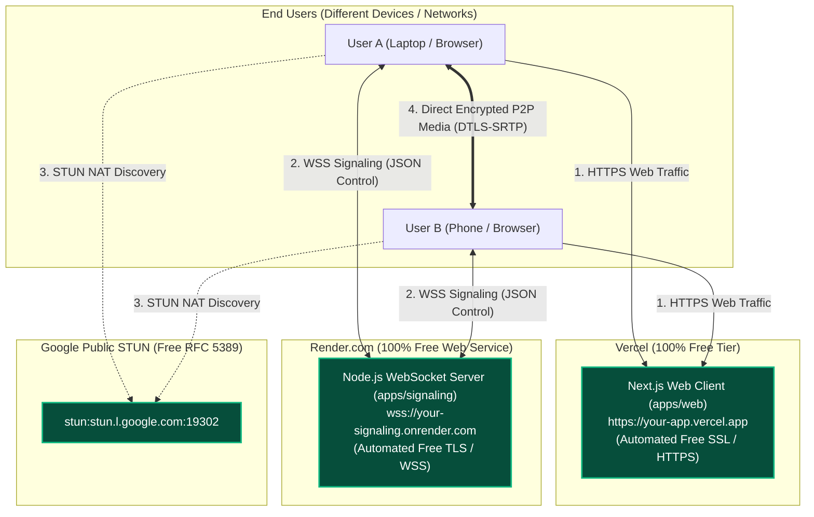

# Free Deployment Guide: Private 1-to-1 Video Calling

This guide details how to deploy the entire application for **100% free** using modern cloud platforms with automated HTTPS and WSS (WebSocket Secure).

---

## 1. Architecture of Free Deployment



---

## 2. Prerequisites

1. A free [GitHub](https://github.com/) account.
2. A free [Render](https://render.com/) account.
3. A free [Vercel](https://vercel.com/) account.

---

## 3. Step 1: Push Code to GitHub

Initialize your Git repository and push it to a new private or public GitHub repository:

```bash
git init
git add .
git commit -m "feat: complete private 1-to-1 WebRTC video calling app"
git branch -M main
git remote add origin https://github.com/<your-username>/<your-repo-name>.git
git push -u origin main
```

---

## 4. Step 2: Deploy the Signaling Server on Render (Free)

Render provides free persistent Web Services with native WebSocket (`wss://`) support.

1. Go to [Render Dashboard](https://dashboard.render.com/) and click **New +** -> **Web Service**.
2. Connect your GitHub repository.
3. Configure the service settings:
   - **Name**: `pvc-signaling` (or your choice)
   - **Region**: Select the region closest to you (e.g. Frankfurt, Oregon, Singapore)
   - **Root Directory**: Leave blank (monorepo root)
   - **Runtime**: `Node`
   - **Build Command**:
     ```bash
     pnpm install --prod=false && pnpm run build:signaling
     ```
   - **Start Command**:
     ```bash
     pnpm --filter @pvc/signaling start
     ```
   - **Instance Type**: Select **Free**
4. Under **Environment Variables**, add:
   - `NODE_ENV`: `production`
   - `ALLOWED_ORIGINS`: `*` (or your Vercel frontend URL once deployed)
5. Click **Deploy Web Service**.
6. Once deployed, Render will provide a public URL, for example:
   ```text
   https://pvc-signaling.onrender.com
   ```
   *(Your WebSocket URL will be `wss://pvc-signaling.onrender.com`)*

---

## 5. Step 3: Deploy the Frontend on Vercel (Free)

Vercel natively builds Next.js monorepos with zero configuration and automated SSL certificates.

1. Go to [Vercel Dashboard](https://vercel.com/dashboard) and click **Add New...** -> **Project**.
2. Select your GitHub repository.
3. In the project configuration:
   - **Framework Preset**: Next.js
   - **Root Directory**: Click "Edit" and select **`apps/web`**
   - **Build Command**: Vercel automatically detects Turborepo. (Default: `cd ../.. && pnpm build --filter=@pvc/web...`)
4. Under **Environment Variables**, add:
   - **Key**: `NEXT_PUBLIC_SIGNALING_URL`
   - **Value**: `wss://pvc-signaling.onrender.com` *(use your actual Render URL with `wss://` prefix)*
5. Click **Deploy**.
6. Vercel will build the Next.js app and provide your production URL:
   ```text
   https://pvc-web.vercel.app
   ```

---

## 6. Step 4: Update CORS on the Signaling Server

For maximum security:
1. Open your Render Web Service dashboard (`pvc-signaling`).
2. Go to **Environment Variables**.
3. Update `ALLOWED_ORIGINS` to match your Vercel domain:
   ```text
   ALLOWED_ORIGINS=https://pvc-web.vercel.app
   ```
4. Click **Save Changes** (Render will automatically re-deploy in a few seconds).

---

## 7. Step 5: Test Across Different Devices & Networks

Now you can test a real cross-network call:
1. Open `https://pvc-web.vercel.app` on your **laptop** (connected to home Wi-Fi).
2. Allow camera and mic permissions.
3. Click **"Copy Link"**.
4. Send the copied invitation link (e.g. via WhatsApp, Signal, or Email) to your **smartphone** (connected to mobile cellular 4G/5G).
5. Open the link on your smartphone's browser (Safari on iOS or Chrome on Android).
6. **Result**:
   - Both devices connect to the signaling server via `wss://`.
   - Public STUN traverses your NAT routers.
   - **Direct peer-to-peer encrypted audio and video (DTLS-SRTP)** streams with zero server lag!
