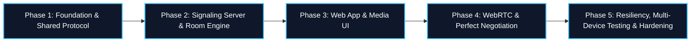

# Phased Implementation Plan

## 1. Overview & Phasing Strategy

This document outlines the step-by-step roadmap for building the private 1-to-1 WebRTC video calling application. Each phase is discrete, independently verifiable, and sequenced to ensure solid architectural foundations before integrating complex peer-to-peer media workflows.

---

## 2. Phase Breakdown

### Phase 1: Monorepo Foundation & Shared Protocol
**Objective**: Establish the workspace infrastructure, build pipelines, and single source of truth for all signaling contracts.

- [ ] **1.1. Workspace Initialization**
  - Initialize root `package.json`, `pnpm-workspace.yaml`, `.gitignore`, `.npmrc`, `.prettierrc`.
  - Configure Turborepo (`turbo.json`) for pipeline orchestration (`build`, `lint`, `typecheck`, `dev`).
- [ ] **1.2. Shared Configurations**
  - Create `packages/tsconfig` with base, Node, and Next.js compiler settings.
  - Create `packages/eslint-config` with standard formatting and TypeScript linting rules.
- [ ] **1.3. Protocol Package (`packages/protocol`)**
  - Define Zod schemas for all WebSocket signaling messages (`join-room`, `room-joined`, `peer-joined`, `peer-left`, `offer`, `answer`, `ice-candidate`, `error`, `ping`, `pong`).
  - Include cryptographic `roomKey` in `join-room` payload schema.
  - Export inferred TypeScript types (`SignalingMessage`, `RoomJoinedPayload`, etc.).
  - Define standard error codes (`UNAUTHORIZED`, `ROOM_FULL`, `INVALID_MESSAGE`, `PEER_NOT_FOUND`).
  - Implement `IceConfigProvider` abstraction with default STUN servers and future TURN configuration hooks.
- [ ] **Verification & Exit Criteria**:
  - `pnpm install`, `pnpm build`, `pnpm typecheck` pass with zero errors across all workspaces.

---

### Phase 2: Node.js Signaling Server
**Objective**: Build a high-performance, strictly-typed WebSocket signaling service with robust 1-to-1 room gatekeeping and token verification.

- [ ] **2.1. Server Scaffold (`apps/signaling`)**
  - Setup Node.js project with TypeScript and `tsup` bundler.
  - Implement lean native HTTP and WebSocket server (`ws`). Zero database or heavy frameworks.
  - Add environment configuration (`PORT`, `ALLOWED_ORIGINS`).
- [ ] **2.2. In-Memory Room Manager & Gatekeeping**
  - Implement `RoomManager` data structure:
    - Map `roomId -> RoomState` containing active sockets and `roomKeyHash`.
    - Validate `roomKey` on join; reject mismatches with `UNAUTHORIZED` (`4401`).
    - Enforce strict 1-to-1 cap: **maximum 2 participants per room**.
    - If 3rd distinct peer attempts join, emit `ROOM_FULL` error and terminate socket (`4403`).
    - Support **Session Reconnection / Replacement**: if a reconnecting peer provides the same `peerId` (e.g. page refresh), replace stale socket without false lockout.
    - Assign `polite: false` (initiator) to first peer and `polite: true` (responder) to second peer.
- [ ] **2.3. Message Dispatcher & Relay Engine**
  - Validate all incoming frames with `@pvc/protocol` Zod schemas.
  - Relay SDP offers, SDP answers, and ICE candidates exclusively to the opposing peer in the room.
  - Implement heartbeat (`ping` / `pong`) and prune unresponsive sockets after 60 seconds.
  - Broadcast `peer-left` event to remaining peer on socket closure.
- [ ] **Verification & Exit Criteria**:
  - Automated integration test: 
    1. Peer 1 creates room with key.
    2. Peer with invalid key is rejected (`UNAUTHORIZED`).
    3. Peer 2 with valid key joins successfully.
    4. 3rd peer is rejected (`ROOM_FULL`).
    5. Peer 1 refreshes page (same `peerId`) and reconnects cleanly without lockout.

---

### Phase 3: Client Application & Media Hardware Controls
**Objective**: Build the Next.js frontend with local camera/microphone acquisition, preview UI, and in-call layouts.

- [ ] **3.1. Next.js Scaffold (`apps/web`)**
  - Initialize Next.js App Router project with TypeScript and Tailwind CSS.
  - Configure root layout, fonts, and dark theme optimized for video calling.
- [ ] **3.2. Hardware Media Management (`useMediaStream` Hook)**
  - Implement camera and microphone capture via `navigator.mediaDevices.getUserMedia`.
  - Handle permission denial, missing devices, and hardware error states cleanly.
  - Provide instantaneous mute/unmute functions by toggling `track.enabled`.
  - Provide hardware teardown (`track.stop()`) on unmount.
- [ ] **3.3. Lobby & Device Test View (`/`)**
  - Room generation producing high-entropy `roomId` and cryptographic `#key=<roomSecret>` hash URL.
  - Device preview pane with live local video and dynamic audio volume indicator.
  - Camera and microphone selectors.
- [ ] **3.4. In-Call Video Room View (`/room/[roomId]`)**
  - Extract room secret from URL hash fragment (`window.location.hash`).
  - Clean video calling layout: full-screen remote video stream + floating local picture-in-picture preview.
  - Media control bar: Mic Mute/Unmute, Camera On/Off, Screen Share, and "End Call" buttons.
  - Connection status badge (Waiting for peer, Connecting, Encrypted Call Active, Disconnected).
- [ ] **Verification & Exit Criteria**:
  - User can test camera/mic in lobby, toggle mute states, copy private invitation link with hash key, and see local video rendering smoothly without errors.

---

### Phase 4: WebRTC Peer Connection & Perfect Negotiation Integration
**Objective**: Connect the web client to the signaling server and establish an encrypted P2P audio/video call.

- [ ] **4.1. Signaling Client Hook (`useSignaling`)**
  - Implement WebSocket client with automatic reconnection and event dispatching.
  - Persist `peerId` in `sessionStorage` across page refreshes.
  - Dispatch incoming messages to the WebRTC state machine.
- [ ] **4.2. WebRTC Hook (`useWebRTC`) & Perfect Negotiation**
  - Initialize `RTCPeerConnection` with STUN servers via `IceConfigProvider`.
  - Gate negotiation on `peerPresent`: only emit offers when remote peer is in the room.
  - Implement W3C Perfect Negotiation:
    - Handle `onnegotiationneeded` with `makingOffer` guard.
    - Implement unified `handleRemoteDescription` for glare-free polite rollback and answer processing.
    - Forward SDP offers and answers through signaling hook.
- [ ] **4.3. Trickle ICE & Media Playback**
  - Implement `onicecandidate` handler to trickle candidates over WebSocket (including null end-of-candidates).
  - Implement candidate queue to buffer candidates arriving before remote description is set; drain queue on offer AND answer.
  - Implement `ontrack` handler to bind remote media stream to remote `<video>` element.
- [ ] **Verification & Exit Criteria**:
  - Two browser tabs or two windows join the same room URL -> negotiate SDP and ICE -> establish direct DTLS-SRTP connection -> two-way audio and video stream successfully.

---

### Phase 5: Resiliency, Multi-Device Testing & Hardening
**Objective**: Test across heterogeneous physical devices and disparate networks; harden error recovery and security.

- [ ] **5.1. ICE Restart & Network Recovery**
  - Monitor `connectionstatechange` and `iceconnectionstatechange`.
  - Trigger `pc.restartIce()` when connection state enters `failed`.
  - Handle brief Wi-Fi / cellular transitions gracefully.
- [ ] **5.2. Multi-Device Cross-Network Verification**
  - Deploy signaling server or tunnel via local HTTPS (mkcert / ngrok / local LAN IP).
  - Test between:
    - Desktop (Wi-Fi) <-> Mobile Phone (Cellular 4G/5G).
    - macOS (Chrome) <-> iOS/macOS (Safari).
- [ ] **5.3. Security & Production Hardening**
  - Enable Origin verification on WebSocket server.
  - Add rate limiting for WebSocket connection requests.
  - Verify CSP headers in Next.js (`next.config.mjs`).
  - Ensure zero SDP or candidate logging in production.
  - Verify camera and microphone indicators turn off immediately on call exit.
- [ ] **Verification & Exit Criteria**:
  - Real 1-to-1 audio and video call established between two distinct physical devices on different networks using STUN.
