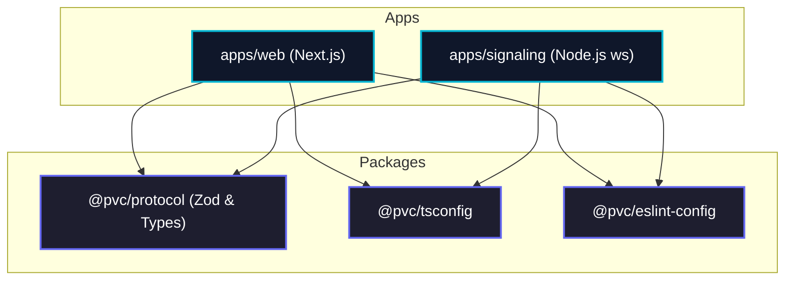

# Monorepo Structure & Package Architecture

## 1. Overview

The codebase is organized as a **pnpm monorepo** managed with **Turborepo** to ensure fast incremental builds, shared tooling, strict package boundaries, and unified type safety between the Next.js frontend and the Node.js signaling server.

---

## 2. Directory Tree

```text
p-v-c/
├── apps/
│   ├── web/                         # Next.js frontend web application
│   │   ├── src/
│   │   │   ├── app/                 # Next.js App Router (pages & layouts)
│   │   │   │   ├── layout.tsx       # Root layout with fonts & theme
│   │   │   │   ├── page.tsx         # Lobby / Room creator page
│   │   │   │   ├── room/
│   │   │   │   │   └── [roomId]/
│   │   │   │   │       └── page.tsx # In-call video room interface
│   │   │   ├── components/          # UI Components
│   │   │   │   ├── media/           # Video elements, audio meters, device selectors
│   │   │   │   ├── controls/        # Mic, camera, end call, settings buttons
│   │   │   │   └── ui/              # Buttons, dialogs, badges (clean primitive components)
│   │   │   ├── hooks/               # React custom hooks
│   │   │   │   ├── useMediaStream.ts    # Hardware acquisition, mic/cam toggle
│   │   │   │   ├── useSignaling.ts      # WebSocket connection & protocol dispatcher
│   │   │   │   └── useWebRTC.ts         # RTCPeerConnection lifecycle & state management
│   │   │   ├── lib/                 # Utilities and client helpers
│   │   │   │   ├── webrtc-config.ts # ICE server definitions (STUN)
│   │   │   │   └── utils.ts
│   │   │   └── styles/              # Global Tailwind CSS
│   │   ├── public/                  # Static assets & icons
│   │   ├── next.config.mjs
│   │   ├── package.json
│   │   ├── postcss.config.mjs
│   │   ├── tailwind.config.ts
│   │   └── tsconfig.json
│   │
│   └── signaling/                   # Standalone Node.js signaling service
│       ├── src/
│       │   ├── server.ts            # Entrypoint & HTTP/WSS server bootstrap
│       │   ├── room/                # Room state management
│       │   │   ├── room-manager.ts  # In-memory room store (strict max 2 peers)
│       │   │   └── peer.ts          # Peer representation & active socket metadata
│       │   ├── handlers/            # Message type dispatchers
│       │   │   ├── join.handler.ts
│       │   │   ├── relay.handler.ts # Forwarding SDP offer/answer/candidates
│       │   │   └── leave.handler.ts
│       │   ├── config/              # Server env, port, allowed origins
│       │   │   └── env.ts
│       │   └── logger.ts            # Structured JSON logger (zero payload logging)
│       ├── package.json
│       ├── tsconfig.json
│       └── tsup.config.ts           # Bundler for fast Node distribution
│
├── packages/
│   ├── protocol/                    # Shared signaling contracts & validations
│   │   ├── src/
│   │   │   ├── index.ts             # Public API export
│   │   │   ├── messages.ts          # Zod schemas & inferred TypeScript types
│   │   │   ├── events.ts            # Event name constants
│   │   │   ├── errors.ts            # Standard protocol error codes
│   │   │   └── constants.ts         # Default ports, ICE servers, timeout configs
│   │   ├── package.json
│   │   └── tsconfig.json
│   │
│   ├── tsconfig/                    # Shared TypeScript configuration
│   │   ├── base.json                # Strict base compiler options
│   │   ├── nextjs.json              # Config for Next.js app
│   │   ├── node.json                # Config for Node.js services
│   │   └── package.json
│   │
│   └── eslint-config/               # Shared linting & formatting standards
│       ├── index.js
│       └── package.json
│
├── docs/                            # Architectural & technical specifications
│   ├── README.md
│   ├── architecture.md
│   ├── monorepo-structure.md
│   ├── signaling-protocol.md
│   ├── webrtc-lifecycle.md
│   ├── security.md
│   └── implementation-plan.md
│
├── .gitignore
├── .npmrc
├── .prettierrc
├── package.json                     # Monorepo root package.json
├── pnpm-lock.yaml
├── pnpm-workspace.yaml              # pnpm workspace definition
└── turbo.json                       # Turborepo task pipeline configuration
```

---

## 3. Workspace Configuration

### 3.1. `pnpm-workspace.yaml`
```yaml
packages:
  - "apps/*"
  - "packages/*"
```

### 3.2. Dependency Graph & Boundary Rules



#### Package Boundary Rules:
1. **Unidirectional Dependency**: Apps depend on packages. Packages **never** depend on apps.
2. **Single Source of Truth for Protocol**: All WebSocket event names, JSON payload shapes, and Zod schemas must reside in `@pvc/protocol`. Neither `apps/web` nor `apps/signaling` may declare raw ad-hoc signaling message types.
3. **No Cross-App Imports**: `apps/web` and `apps/signaling` are isolated runtimes and must never import directly from each other.

---

## 4. Turborepo Pipeline (`turbo.json`)

Turborepo coordinates build order and caching across workspace packages:

```json
{
  "$schema": "https://turbo.build/schema.json",
  "tasks": {
    "build": {
      "dependsOn": ["^build"],
      "outputs": [".next/**", "!.next/cache/**", "dist/**"]
    },
    "lint": {
      "dependsOn": ["^build"]
    },
    "typecheck": {
      "dependsOn": ["^build"]
    },
    "dev": {
      "cache": false,
      "persistent": true
    }
  }
}
```

---

## 5. Development Workflow & Commands

| Command | Action | Scope |
| :--- | :--- | :--- |
| `pnpm install` | Install all dependencies across the entire monorepo | Root |
| `pnpm dev` | Concurrently start Next.js dev server and Node signaling server | Root / Turborepo |
| `pnpm dev:web` | Start only the Next.js frontend on `http://localhost:3000` | Filter `--filter=@pvc/web` |
| `pnpm dev:sig` | Start only the Node.js signaling server on `ws://localhost:8080` | Filter `--filter=@pvc/signaling` |
| `pnpm build` | Compile shared packages, build signaling server, build Next.js | Root / Turborepo |
| `pnpm typecheck` | Run `tsc --noEmit` across all apps and packages | Root / Turborepo |
| `pnpm lint` | Run ESLint across all apps and packages | Root / Turborepo |
