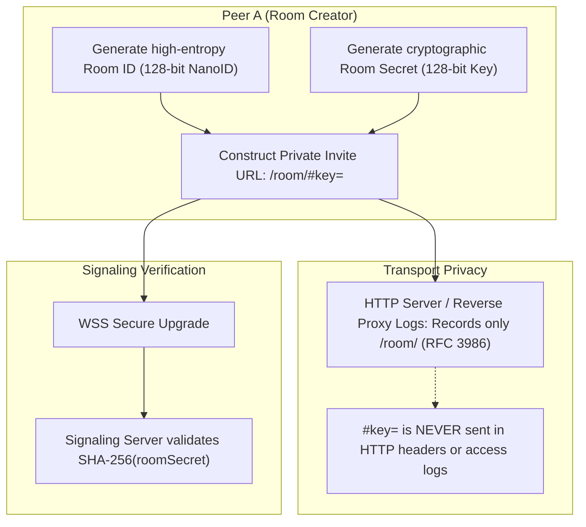
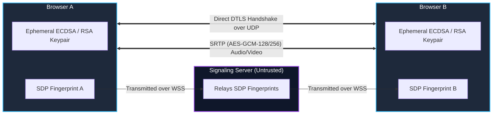

# Security, Privacy & Cryptographic Specification

## 1. Threat Model & Privacy Philosophy

The primary objective of this application is providing **confidential 1-to-1 audio and video communications**. 

The architecture adheres to a **Zero-Knowledge Media Architecture**:
- Media streams flow strictly peer-to-peer over UDP.
- The signaling server is an untrusted message pipe. It facilitates connection establishment, but has zero cryptographic capability to decrypt, record, or tap audio/video streams.
- Room access is gated, private, authenticated by invitation secrets, and strictly limited to 2 participants.

---

## 2. Room IDs, Invitation Tokens & Zero-Leakage URL Design



### 2.1. Cryptographic Entropy
- **Room ID (`roomId`)**: 21-character URL-safe string generated using `crypto.getRandomValues()` with > 120 bits of entropy (e.g., NanoID format `k8sL2m9Pq0vWx7Yt1ZaB3c`). Enumeration or guessing is computationally impossible.
- **Invitation Secret (`roomKey`)**: 24-character cryptographic key (140+ bits of entropy).

### 2.2. Zero-Leakage URL Hash Fragments
The invitation URL is constructed as:
```text
https://call.example.com/room/<roomId>#key=<roomSecret>
```
**Why the `#` hash fragment is crucial**:
Under RFC 3986 (Uniform Resource Identifier Specification), URI fragments are strictly processed client-side by the user agent. The browser **never** includes the fragment in HTTP request lines, `GET` request headers, or `Referer` headers.
- NGINX, Cloudflare, AWS ALB, and hosting server logs **never see or record the room secret**.
- If a user shares the link, intermediate proxies and web servers cannot log or exploit the credentials.

### 2.3. Signaling Server Secret Verification
1. When Peer 1 creates the room, their client reads the hash fragment and transmits `{ roomId, roomKey }` over TLS (`wss://`).
2. The signaling server computes `roomKeyHash = crypto.createHash('sha256').update(roomKey).digest('hex')` and stores it in volatile memory for that active room.
3. When Peer 2 accesses the URL, their client extracts the hash and passes `roomKey` in the `join-room` payload.
4. The server validates the constant-time equality of the incoming key's SHA-256 hash. If it matches, Peer 2 is admitted. If it fails, the connection is instantly rejected with `UNAUTHORIZED` (`4401`).

---

## 3. Media Plane Cryptography (Native WebRTC DTLS-SRTP)

WebRTC mandates end-to-end encryption at the transport layer for all media and data channels via RFC 3711 (SRTP) and RFC 5763 / 5764 (DTLS-SRTP).



### 3.1. Key Exchange & Master Key Isolation
1. During `RTCPeerConnection` initialization, each browser independently generates an ephemeral cryptographic keypair (ECDSA P-256).
2. The public key fingerprint (SHA-256) is included in the local SDP offer/answer (`a=fingerprint:sha-256 ...`).
3. When direct UDP connectivity is established, peers perform a standard **DTLS handshake** directly with each other.
4. Each peer verifies that the remote certificate presented in the DTLS handshake matches the SHA-256 fingerprint received in the SDP.
5. Symmetric encryption keys are derived via DTLS-SRTP key export to encrypt subsequent RTP audio and video packets using **AES-GCM-128** or **AES-GCM-256**.
6. **Key Isolation**: The signaling server never participates in the DTLS handshake and has zero access to the derived SRTP master keys. Media cannot be decrypted by the server under any circumstances.

---

## 4. Signaling Plane Security

### 4.1. Transport Layer Security (WSS)
- In production, WebSocket connections must strictly require `wss://` (TLS 1.3 / TLS 1.2).
- Plaintext `ws://` connections are disallowed outside of local development (`localhost`).

### 4.2. Cross-Site WebSocket Hijacking (CSWSH) Prevention
Malicious third-party websites cannot open unauthorized WebSocket connections on behalf of a user because the server validates the HTTP `Origin` header during the initial upgrade handshake:
```typescript
function verifyClientOrigin(origin: string | undefined): boolean {
  if (!origin) return false;
  const allowedOrigins = process.env.ALLOWED_ORIGINS?.split(",") || ["http://localhost:3000"];
  return allowedOrigins.includes(origin);
}
```

### 4.3. Input Sanitization & Payload Validation (Zod)
Every message frame received over a WebSocket socket is validated against strict Zod schemas before processing.
- Maximum frame size limit of **64 KB** enforced at the WebSocket layer.
- Unknown properties are rejected.
- Malformed JSON triggers socket termination to prevent resource exhaustion attacks.

### 4.4. Rate Limiting & DoS Protection
- **Connection Rate Limiting**: Maximum 10 connection attempts per minute per IP address.
- **Message Rate Limiting**: Maximum 60 signaling messages per minute per active socket (accommodates high-frequency trickle ICE bursts while mitigating flooding).

---

## 5. Room Access Control & Data Minimization

### 5.1. Strict 1-to-1 Capacity Enforcement
- The signaling server maintains an in-memory counter of connected peers per room.
- If a room already has 2 participants, any subsequent join request from a different peer receives a `ROOM_FULL` error code and the connection is closed immediately.
- This prevents eavesdroppers or unexpected third parties from silently joining an active conversation.

### 5.2. Zero Persistent Storage & Ephemeral Lifecycle
- **Zero Database**: Rooms exist solely in volatile Node.js process memory.
- **Instant Garbage Collection**: When both participants disconnect, all room metadata is immediately deleted from memory.
- **Zero Media Logging**: The signaling server does not log SDP descriptions or ICE candidate payloads in production logs.
- **Zero Call Records**: No user identifiers, call timestamps, durations, or call graphs are stored in persistent databases.

---

## 6. Client & Browser Security Policies

### 6.1. Secure Contexts Requirement
Modern browsers restrict `navigator.mediaDevices.getUserMedia` exclusively to Secure Contexts (`https://` or `localhost`). Unencrypted HTTP deployments will fail to access camera or microphone hardware.

### 6.2. HTTP Security Headers
The Next.js web application enforces strict HTTP security headers:
```javascript
// next.config.mjs headers
const securityHeaders = [
  {
    key: "Content-Security-Policy",
    value: [
      "default-src 'self'",
      "script-src 'self' 'unsafe-eval' 'unsafe-inline'",
      "style-src 'self' 'unsafe-inline'",
      "media-src 'self' blob:",
      "connect-src 'self' wss: ws: https: stun:",
      "camera 'self'",
      "microphone 'self'"
    ].join("; ")
  },
  {
    key: "Permissions-Policy",
    value: "camera=(self), microphone=(self), display-capture=(self)"
  },
  {
    key: "X-Content-Type-Options",
    value: "nosniff"
  },
  {
    key: "X-Frame-Options",
    value: "DENY"
  },
  {
    key: "Referrer-Policy",
    value: "strict-origin-when-cross-origin"
  }
];
```

### 6.3. Hardware Indicator Management
- When a call ends or a track is disabled, the client explicitly stops all `MediaStreamTrack` instances:
  ```typescript
  stream.getTracks().forEach(track => track.stop());
  ```
  This immediately turns off the operating system's camera and microphone indicator lights, giving users visual certainty that recording has ceased.
