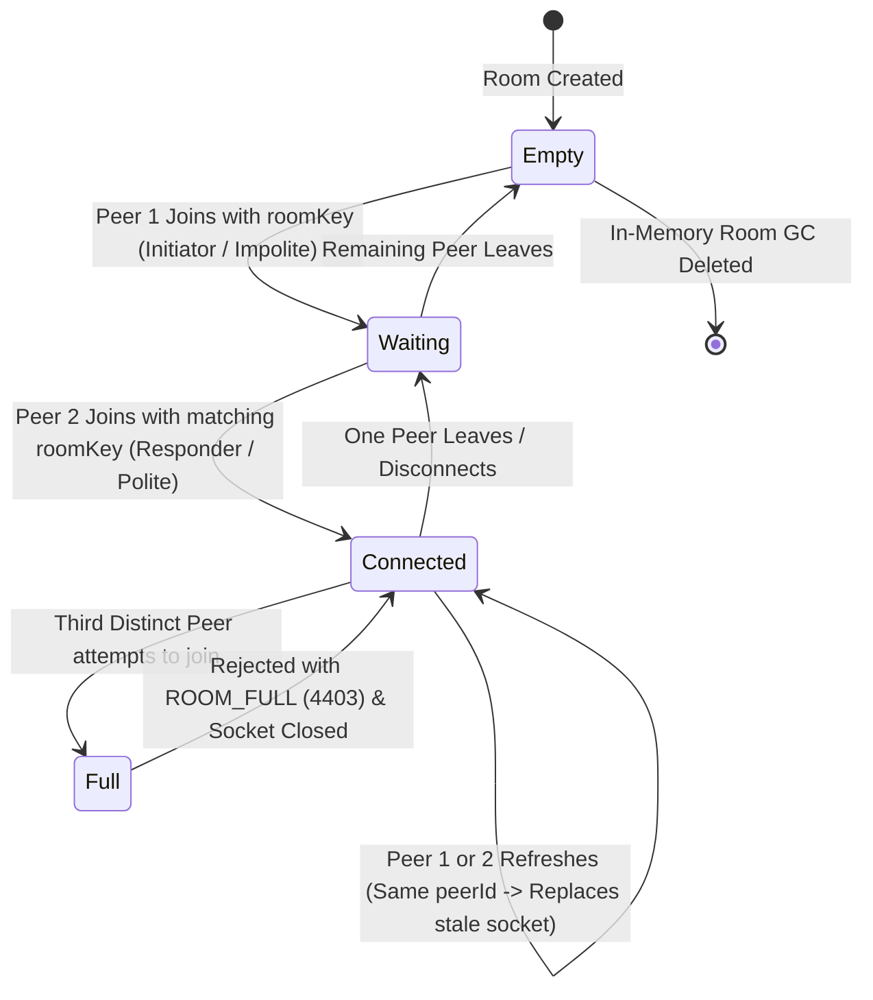

# WebSocket Signaling Protocol Specification

## 1. Overview

The signaling layer enables two WebRTC peers to discover each other, negotiate media capabilities via Session Description Protocol (SDP), and exchange Interactive Connectivity Establishment (ICE) network candidates.

The signaling server **never processes, decodes, or routes media**. It acts as a lightweight, strictly typed message relay, room gatekeeper, and invitation token verifier.

---

## 2. Transport & Envelope Specification

- **Transport**: WebSocket (`ws://` for development, `wss://` for production).
- **Serialization**: UTF-8 JSON.
- **Envelope Standard**: All messages exchanged across the WebSocket connection adhere to the standard envelope structure:

```typescript
interface SignalingEnvelope<T = unknown> {
  /** Unique message identifier for tracing and idempotency */
  id: string;
  /** Protocol action type */
  type: SignalingMessageType;
  /** Target room identifier */
  roomId: string;
  /** Unique ephemeral ID of the sending peer (persisted in sessionStorage per tab) */
  senderId: string;
  /** Target peer ID (optional; defaults to the opposing peer in 1-to-1) */
  targetId?: string;
  /** Payload specific to the message type */
  payload: T;
  /** Epoch timestamp in milliseconds */
  timestamp: number;
}
```

---

## 3. Message Types & Payloads

### 3.1. Client -> Server Messages

#### 1. `join-room`
Dispatched when a client initiates connection to a designated room.
```json
{
  "id": "msg_01HX...",
  "type": "join-room",
  "roomId": "room_k8sL2m9Pq0vW",
  "senderId": "peer_usr_8923",
  "payload": {
    "roomKey": "sec_7aB3cF4gH1jK9...",
    "displayName": "User A"
  },
  "timestamp": 1726310000000
}
```

> **Security Note**: `roomKey` is the invitation secret passed in the URL hash fragment (`/room/<id>#key=<secret>`). It is validated by the server upon join.

#### 2. `offer`
Dispatched by the negotiating peer containing an SDP offer.
```json
{
  "id": "msg_01HX...",
  "type": "offer",
  "roomId": "room_k8sL2m9Pq0vW",
  "senderId": "peer_usr_8923",
  "payload": {
    "sdp": {
      "type": "offer",
      "sdp": "v=0\r\no=- 423984 2 IN IP4 127.0.0.1\r\ns=-\r\nt=0 0\r\na=group:BUNDLE 0 1\r\n..."
    }
  },
  "timestamp": 1726310002000
}
```

#### 3. `answer`
Dispatched by the responding peer containing an SDP answer.
```json
{
  "id": "msg_01HX...",
  "type": "answer",
  "roomId": "room_k8sL2m9Pq0vW",
  "senderId": "peer_usr_4451",
  "payload": {
    "sdp": {
      "type": "answer",
      "sdp": "v=0\r\no=- 874291 2 IN IP4 127.0.0.1\r\ns=-\r\nt=0 0\r\na=group:BUNDLE 0 1\r\n..."
    }
  },
  "timestamp": 1726310003000
}
```

#### 4. `ice-candidate`
Dispatched as local network candidates are harvested (Trickle ICE), including `null` for end-of-candidates.
```json
{
  "id": "msg_01HX...",
  "type": "ice-candidate",
  "roomId": "room_k8sL2m9Pq0vW",
  "senderId": "peer_usr_8923",
  "payload": {
    "candidate": {
      "candidate": "candidate:842163049 1 udp 1677729535 203.0.113.10 45230 typ srflx raddr 192.168.1.5 rport 45230 generation 0 ufrag ...",
      "sdpMid": "0",
      "sdpMLineIndex": 0,
      "usernameFragment": "..."
    }
  },
  "timestamp": 1726310003500
}
```

#### 5. `leave-room`
Dispatched when a user intentionally terminates their call.
```json
{
  "id": "msg_01HX...",
  "type": "leave-room",
  "roomId": "room_k8sL2m9Pq0vW",
  "senderId": "peer_usr_8923",
  "payload": {},
  "timestamp": 1726310050000
}
```

#### 6. `ping`
Client-side heartbeat frame.
```json
{
  "id": "msg_01HX...",
  "type": "ping",
  "roomId": "room_k8sL2m9Pq0vW",
  "senderId": "peer_usr_8923",
  "payload": {},
  "timestamp": 1726310030000
}
```

---

### 3.2. Server -> Client Messages

#### 1. `room-joined`
Sent back to the connecting client confirming entrance and establishing negotiation politeness.
```json
{
  "id": "srv_01HX...",
  "type": "room-joined",
  "roomId": "room_k8sL2m9Pq0vW",
  "senderId": "system",
  "payload": {
    "peerId": "peer_usr_8923",
    "isInitiator": true,
    "polite": false,
    "peerCount": 1,
    "existingPeers": []
  },
  "timestamp": 1726310000100
}
```

> **Polite Peer Assignment**:
> The first peer to join the room is assigned `isInitiator: true` and `polite: false` (impolite). The second peer to join is assigned `isInitiator: false` and `polite: true` (polite). This configuration powers the **W3C Perfect Negotiation** pattern.

#### 2. `peer-joined`
Broadcast to the existing peer when the second participant enters.
```json
{
  "id": "srv_01HX...",
  "type": "peer-joined",
  "roomId": "room_k8sL2m9Pq0vW",
  "senderId": "system",
  "payload": {
    "peerId": "peer_usr_4451",
    "displayName": "User B"
  },
  "timestamp": 1726310001500
}
```

#### 3. `peer-left`
Sent to the remaining peer when the remote peer disconnects or leaves.
```json
{
  "id": "srv_01HX...",
  "type": "peer-left",
  "roomId": "room_k8sL2m9Pq0vW",
  "senderId": "system",
  "payload": {
    "peerId": "peer_usr_4451",
    "reason": "disconnected"
  },
  "timestamp": 1726310050100
}
```

#### 4. `error`
Dispatched when an operation violates protocol constraints.
```json
{
  "id": "srv_01HX...",
  "type": "error",
  "roomId": "room_k8sL2m9Pq0vW",
  "senderId": "system",
  "payload": {
    "code": "ROOM_FULL",
    "message": "Room already contains 2 active participants. Connection rejected."
  },
  "timestamp": 1726310010000
}
```

#### 5. `pong`
Server heartbeat response.
```json
{
  "id": "srv_01HX...",
  "type": "pong",
  "roomId": "room_k8sL2m9Pq0vW",
  "senderId": "system",
  "payload": {},
  "timestamp": 1726310030050
}
```

---

## 4. Room Gatekeeping, Capacity & Reconnection Logic

The room state machine enforces a strict limit of 2 participants while gracefully supporting **session reconnection** (e.g. on browser page refresh):



### Protocol Rules for Room Gatekeeping:

1. **Room Creation (0 -> 1 Peer)**:
   - Peer 1 sends `join-room` with `roomId`, `roomKey`, and `peerId`.
   - The server stores `roomKeyHash = SHA-256(roomKey)`.
   - Peer 1 is assigned `isInitiator: true, polite: false`.

2. **Room Pairing (1 -> 2 Peers)**:
   - Peer 2 sends `join-room` with `roomId`, `roomKey`, and `peerId`.
   - The server verifies: `SHA-256(incoming.roomKey) === roomKeyHash`.
   - If mismatch: send `{ type: "error", payload: { code: "UNAUTHORIZED" } }` and close socket (`4401`).
   - If matched: Peer 2 is assigned `isInitiator: false, polite: true`.
   - Existing Peer 1 receives `{ type: "peer-joined", payload: { peerId: Peer 2 } }`.

3. **Reconnection & Refresh Handling**:
   - If a join request arrives for an existing room with a `peerId` matching an active peer:
   - The server terminates the previous socket (`4409 Replaced By New Connection`) and binds the new socket to that peer slot.
   - This prevents browser page reloads from being falsely locked out as a 3rd peer!

4. **Third Party Rejection (Capacity >= 2)**:
   - If a join request arrives with a *new* `peerId` while the room already has 2 active participants:
   - The server emits `{ type: "error", payload: { code: "ROOM_FULL" } }` and closes the socket (`4403 Forbidden`).

---

## 5. Standard Error Codes

| Code | Description | Socket Close Action |
| :--- | :--- | :--- |
| `UNAUTHORIZED` | Provided `roomKey` does not match the room's secret key | Close (4401) |
| `ROOM_FULL` | The room already has 2 distinct active participants | Close (4403) |
| `INVALID_MESSAGE` | Schema validation failed (malformed JSON or invalid envelope) | Keep open / Close on repeated offenses |
| `ROOM_NOT_FOUND` | Signaling operation attempted on non-existent room | Keep open |
| `PEER_NOT_FOUND` | Target peer has already disconnected | Keep open |
| `RATE_LIMITED` | Peer exceeded maximum messages per second | Throttle / Close (4429) |
| `INTERNAL_ERROR` | Unhandled exception on signaling server | Close (1011) |

---

## 6. Heartbeat & Stale Connection Pruning

1. Clients send a `ping` every **30 seconds**.
2. If the signaling server does not receive any ping or activity from an active socket within **60 seconds**, the socket is terminated (`4408 Request Timeout`).
3. Upon socket closure (clean or ungraceful), the room manager removes the peer and notifies the remaining peer via `peer-left` within **50ms**.
