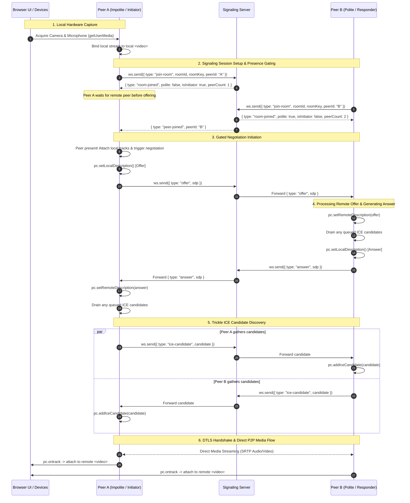

# WebRTC Lifecycle & Perfect Negotiation Specification

## 1. Overview

Establishing a resilient peer-to-peer audio/video connection over disparate networks requires orchestrating local media hardware, signaling exchanges, asynchronous network path exploration (ICE), and codec negotiation.

This application implements the standard **W3C "Perfect Negotiation"** pattern to eliminate race conditions ("glare") during connection setup and dynamic track renegotiation (e.g., adding screenshare, toggling video).

---

## 2. End-to-End Lifecycle Sequence



---

## 3. The Perfect Negotiation State Machine (W3C Standard)

The **Perfect Negotiation** pattern decouples the negotiation trigger (`onnegotiationneeded`) from role conflicts by designating one peer as **polite** and the other as **impolite**.

### 3.1. Core State Definition
```typescript
interface PerfectNegotiationState {
  makingOffer: boolean;
  ignoreOffer: boolean;
  isSettingRemoteAnswerPending: boolean;
  polite: boolean;
  peerPresent: boolean;
}
```

### 3.2. Negotiation Trigger (`onnegotiationneeded`)
To prevent emitting offers into a void before the second peer has entered the room, the negotiation trigger is gated on `peerPresent`:

```typescript
pc.onnegotiationneeded = async () => {
  // Gate negotiation: only emit offers when a remote peer is verified in the room
  if (!peerPresent) {
    return;
  }

  try {
    makingOffer = true;
    await pc.setLocalDescription();
    signaling.send({
      type: "offer",
      payload: { sdp: pc.localDescription }
    });
  } catch (err) {
    console.error("Negotiation needed error:", err);
  } finally {
    makingOffer = false;
  }
};
```

### 3.3. Unified Remote Description Handler (Offer & Answer Processing)
This adheres strictly to the canonical W3C specification for offer collision ("glare") handling:

```typescript
async function handleRemoteDescription(description: RTCSessionDescriptionInit) {
  const readyForOffer =
    !makingOffer &&
    (pc.signalingState === "stable" || isSettingRemoteAnswerPending);

  const offerCollision = description.type === "offer" && !readyForOffer;

  // An impolite peer ignores a colliding offer; a polite peer yields
  ignoreOffer = !polite && offerCollision;
  if (ignoreOffer) {
    return;
  }

  if (description.type === "offer") {
    if (offerCollision) {
      // Polite peer rolls back its local offer in favor of the incoming offer
      await pc.setLocalDescription({ type: "rollback" });
    }
    await pc.setRemoteDescription(description);
    await drainCandidateQueue();

    await pc.setLocalDescription(); // Creates and sets answer automatically
    signaling.send({
      type: "answer",
      payload: { sdp: pc.localDescription }
    });
  } else {
    // Handling incoming answer
    isSettingRemoteAnswerPending = true;
    await pc.setRemoteDescription(description);
    isSettingRemoteAnswerPending = false;
    await drainCandidateQueue();
  }
}
```

> **Key Difference from Buggy Implementations**:
> `ignoreOffer` is strictly evaluated and scoped to colliding incoming **offers**. Answers are **never** rejected by `ignoreOffer`, ensuring an impolite peer always processes the answer to its own offer.

---

## 4. Trickle ICE & Candidate Buffering

ICE candidates are harvested asynchronously as the browser tests local network interfaces and contacts the STUN server.

### 4.1. Local Candidate Generation
```typescript
pc.onicecandidate = (event) => {
  if (event.candidate) {
    signaling.send({
      type: "ice-candidate",
      payload: { candidate: event.candidate.toJSON() }
    });
  } else {
    // End-of-candidates notification (null candidate)
    signaling.send({
      type: "ice-candidate",
      payload: { candidate: null }
    });
  }
};
```

### 4.2. Candidate Queue & Race Prevention
An ICE candidate cannot be added via `pc.addIceCandidate()` before `pc.remoteDescription` is set.
To prevent unhandled exceptions, incoming candidates are buffered if `remoteDescription` is absent:

```typescript
const candidateQueue: (RTCIceCandidateInit | null)[] = [];

async function handleRemoteCandidate(candidate: RTCIceCandidateInit | null) {
  // Gracefully handle end-of-candidates indicator
  if (!candidate || !candidate.candidate) {
    return;
  }

  if (!pc.remoteDescription) {
    candidateQueue.push(candidate);
    return;
  }

  try {
    await pc.addIceCandidate(candidate);
  } catch (err) {
    // If the candidate arrived for an offer that was politely ignored, suppress error
    if (!ignoreOffer) {
      console.warn("Failed to add ICE candidate:", err);
    }
  }
}

async function drainCandidateQueue() {
  while (candidateQueue.length > 0) {
    const candidate = candidateQueue.shift();
    if (candidate) {
      try {
        await pc.addIceCandidate(candidate);
      } catch (err) {
        if (!ignoreOffer) {
          console.warn("Failed to drain ICE candidate:", err);
        }
      }
    }
  }
}
```

---

## 5. Media Track Management & Controls

### 5.1. Hardware Acquisition
```typescript
const constraints: MediaStreamConstraints = {
  audio: {
    echoCancellation: true,
    noiseSuppression: true,
    autoGainControl: true
  },
  video: {
    width: { ideal: 1280, max: 1920 },
    height: { ideal: 720, max: 1080 },
    frameRate: { ideal: 30, max: 60 },
    facingMode: "user"
  }
};

const localStream = await navigator.mediaDevices.getUserMedia(constraints);
```

### 5.2. Instantaneous Mute / Unmute (Zero Renegotiation)
To mute mic or disable camera without breaking connection or triggering renegotiation:
- **Audio Mute**: `localStream.getAudioTracks().forEach(t => t.enabled = false)`
- **Audio Unmute**: `localStream.getAudioTracks().forEach(t => t.enabled = true)`
- **Video Off**: `localStream.getVideoTracks().forEach(t => t.enabled = false)`
- **Video On**: `localStream.getVideoTracks().forEach(t => t.enabled = true)`

> *Note*: Changing `track.enabled` continues transmitting silence or blank frames without destroying the underlying RTP stream, maintaining instantaneous toggles.

### 5.3. Dynamic Track Replacement (e.g. Screen Share / Camera Swap)
```typescript
async function replaceVideoTrack(newTrack: MediaStreamTrack) {
  const sender = pc.getSenders().find(s => s.track?.kind === "video");
  if (sender) {
    await sender.replaceTrack(newTrack);
  }
}
```

---

## 6. Connection States & Error Recovery

### 6.1. State Monitoring
```typescript
pc.onconnectionstatechange = () => {
  switch (pc.connectionState) {
    case "connected":
      // Direct media active
      break;
    case "disconnected":
      // Transient network interruption; ICE may self-heal
      break;
    case "failed":
      // Network path broken; trigger ICE restart
      attemptIceRestart();
      break;
    case "closed":
      // Session finalized
      break;
  }
};
```

### 6.2. Automatic ICE Restart
If the connection state shifts to `failed`:
```typescript
function attemptIceRestart() {
  if (pc.restartIce) {
    pc.restartIce(); // Automatically triggers onnegotiationneeded with ice-restart flag
  } else {
    pc.createOffer({ iceRestart: true }).then(offer => pc.setLocalDescription(offer));
  }
}
```

---

## 7. Graceful Teardown Procedure

When a user clicks "End Call" or leaves the page:
1. **Stop Local Tracks**: Call `.stop()` on every `MediaStreamTrack` to immediately extinguish browser hardware camera/microphone LEDs.
2. **Close PeerConnection**: `pc.close()`.
3. **Dispatch Disconnect Event**: Send `{ type: "leave-room" }` over WebSocket.
4. **Close WebSocket**: `ws.close(1000, "Normal Closure")`.
5. **Clear Media Buffers**: Set video elements' `srcObject = null`.
